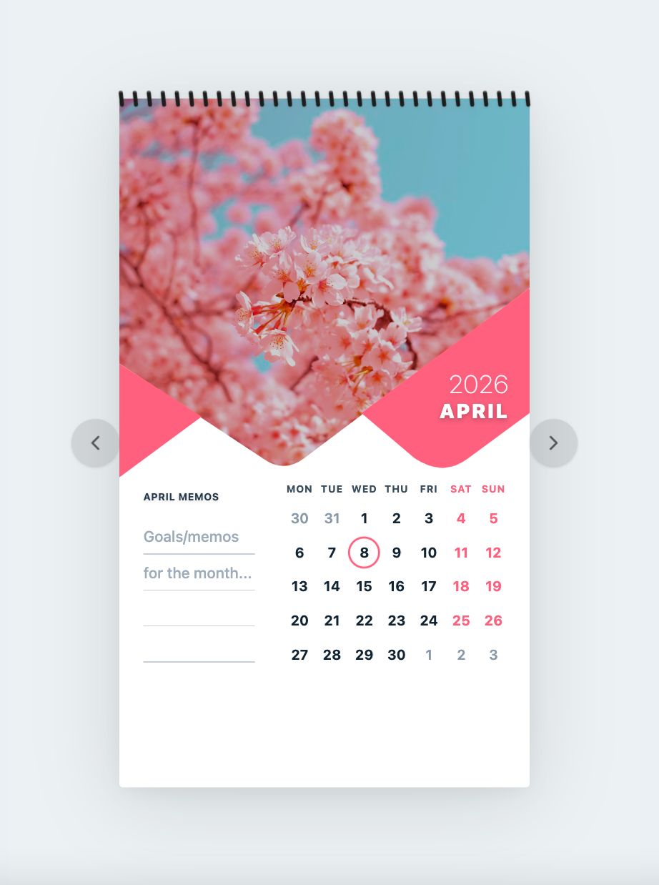
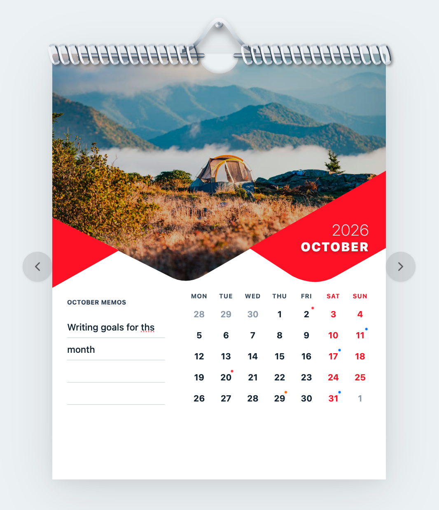
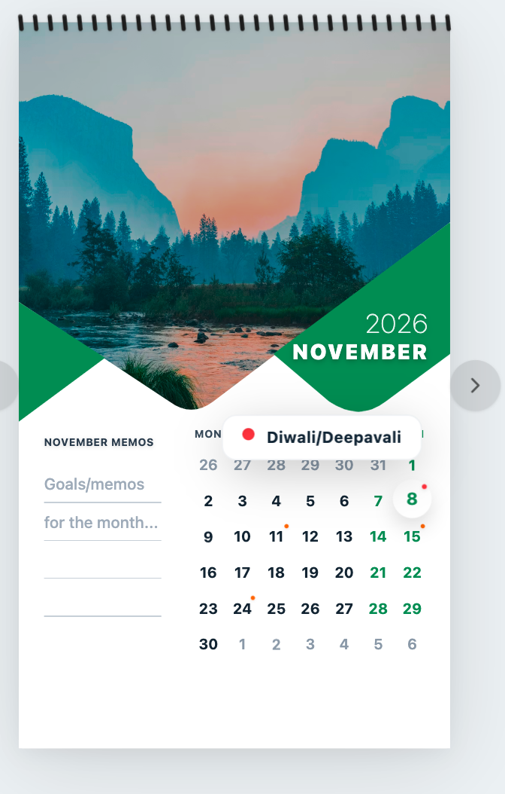
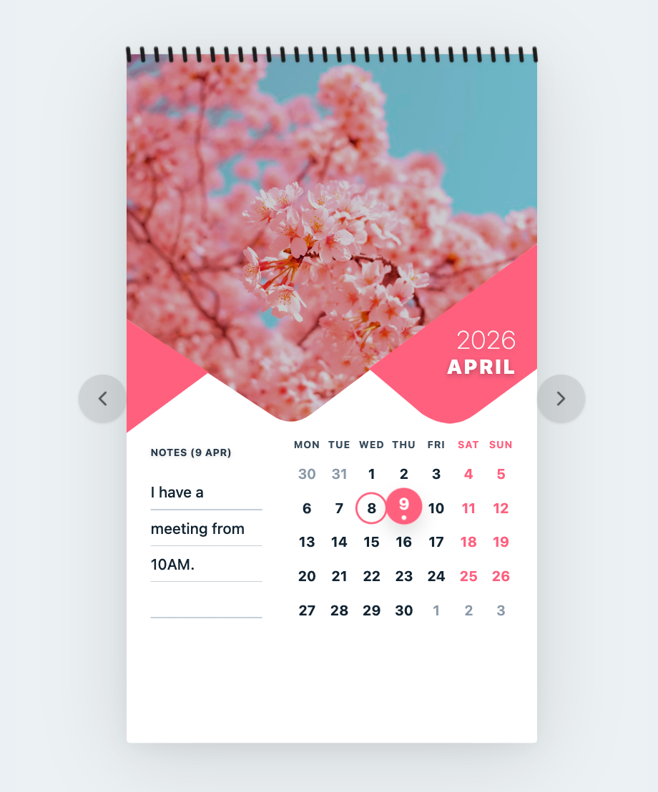
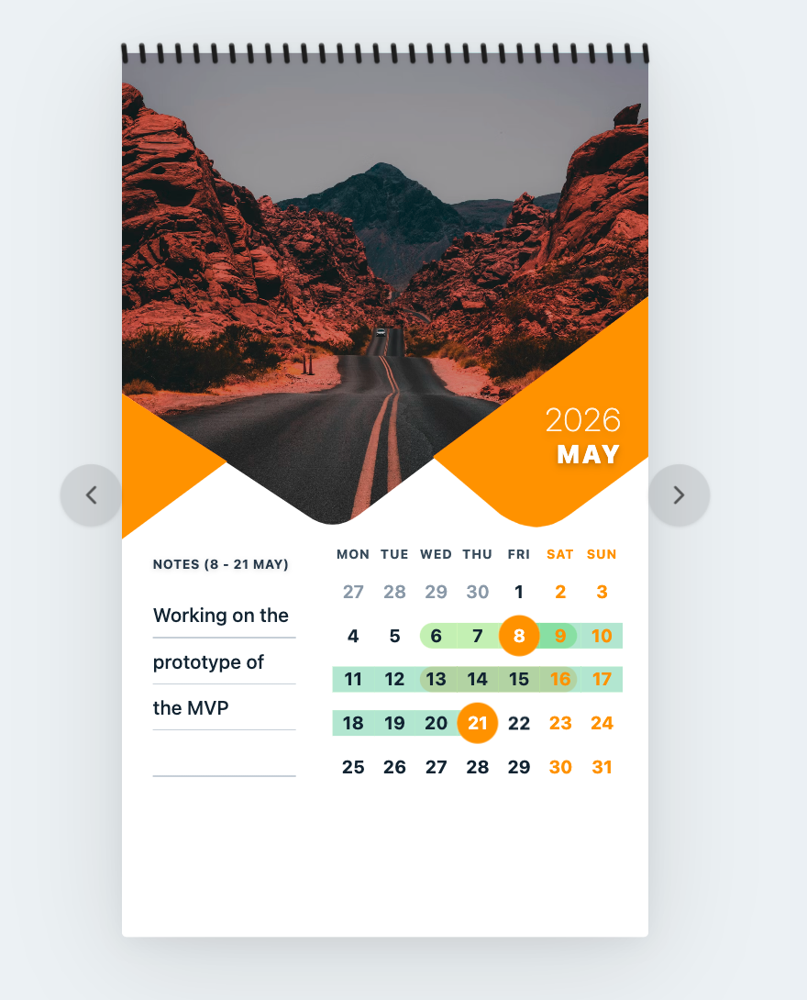

# 📅 3D Kinetic Calendar
<p align="center">
  
</p>

A beautifully structured, highly interactive print-style digital calendar. Built from the ground up prioritizing fluid kinetic physics, thematic environmental aesthetics, and seamless multi-date spanning logic natively. 

## 🌟 Key Features

- **Realistic 3D Physics Tracking:** Grid blocks and interactive date chips tilt dynamically following mouse-hover mechanics built cleanly into the DOM using dynamic matrix translation, making the entire board feel intensely tactile and alive.
- **Dynamic Holiday Engine (2024–2028):** Contains a massive pre-loaded Indian holiday JSON database spanning 5 years. The calendar mechanically auto-scans the active month and statically injects categorical, color-coded tracking dots exactly matching holiday severities natively (e.g., Red for National, Orange for Regional). 
- **Interactive Framer Tooltips:** Bypasses clunky native browser `title` tags completely. Instead, hovering over any holiday node triggers a highly-styled, glassy `<AnimatePresence>` popover card rendering explicit holiday metadata safely and smoothly!
- **Kindle-Style Page Flips:** Swiping vertically, clicking, or hovering over the literal bottom corner "fold" zones of the calendar natively triggers a structural physics page peeling transition into the previous or next calendar month.
- **Multi-Day Range Selection Tracking:** Clicking multiple distinct dates bridges an overarching selection directly across the internal engine! Spanning dates mechanically interlocks a continuous highlighting ribbon bridging physically underneath the dates. 
- **Atomic Memo Persistence:** Any contextual text you drop inside a single day, an overarching multi-day range bounds, or into the generic month header is automatically mapped and pinned securely into your local storage database! Overlapping selections mechanically stack isolated color-changing bands intelligently using structural hue rotation!
  <p align="center">
    
  </p>
- **Seasonal Environment Themes:** Every chronological month natively tracks a hardcoded atmospheric ambient image specifically clipped to absolute vector masks bounding against corresponding palette accents mathematically syncing the theme.
- **Mobile Responsive Anchoring:** Uses explicit `max-width` tracking and structural viewport clamping limits rigorously to safely squeeze the geometry accurately into mobile screens effortlessly without shattering nested grid logic arrays mechanically.

## 🖱️ How To Use

- **Discover Holidays:** Look out for dates featuring a brilliantly colored dot pinned strictly to the upper-right corner. Simply hover your mouse (or tap on mobile) over the date block to physically summon the glassy tool-tip detailing the exact national or regional event!
<p align="center">
    
  </p>
- **Write Single Day Notes:** Click any specific active date block. Its UI color will brightly invert. Start typing directly into the left hand "Notes" console — a classic solid indicator dot will dynamically dive right underneath the number confirming its explicit atomic connection!
  <p align="center">
    
  </p>
- **Span Multi-Date Ranges:** Click your initial start date, then click another chronologically later end-date. The calendar completely maps a continuous soft visual background ribbon connecting all cells structurally! Text data input here maps explicitly against the entirety of the visual timeline bounds seamlessly.
  <p align="center">
    
  </p>
- **Clear Selections:** Tap any visual spatial void natively padding the outside edges or external tracking gaps dynamically dropping your currently forming active selection boundary locks completely back to zero instantly!
- **Turn The Page:** The actual bottom-left and bottom-right extreme corners structurally behave like peelable paper geometry natively. Tap or physically swipe/pan over tracking spots vertically up to pull the paper dynamically backwards or flip it aggressively forward! 
  <p align="center">
    
  </p>

## 🛠️ Built With
- **Frontend Architecture:** React + TypeScript
- **Bundler Compiler:** Vite
- **DOM Animation Matrices:** Framer Motion
- **CSS Class Engine:** Tailwind CSS 

## 🚀 Getting Started

To run this structural environment natively on your own machine, simply pull the file bounds and boot the standard node environment natively:

```bash
# Install core NPM Dependencies
npm install

# Start Local Server environment
npm run dev
```

Build constraints mechanically enforce standard `TypeScript` linting prior to compile completion exactly resolving cleanly preventing unexpected UI bounds breaking or routing deployment failures on environments strictly matching `Vercel` native builds out-of-the-box (`npm run build`).
